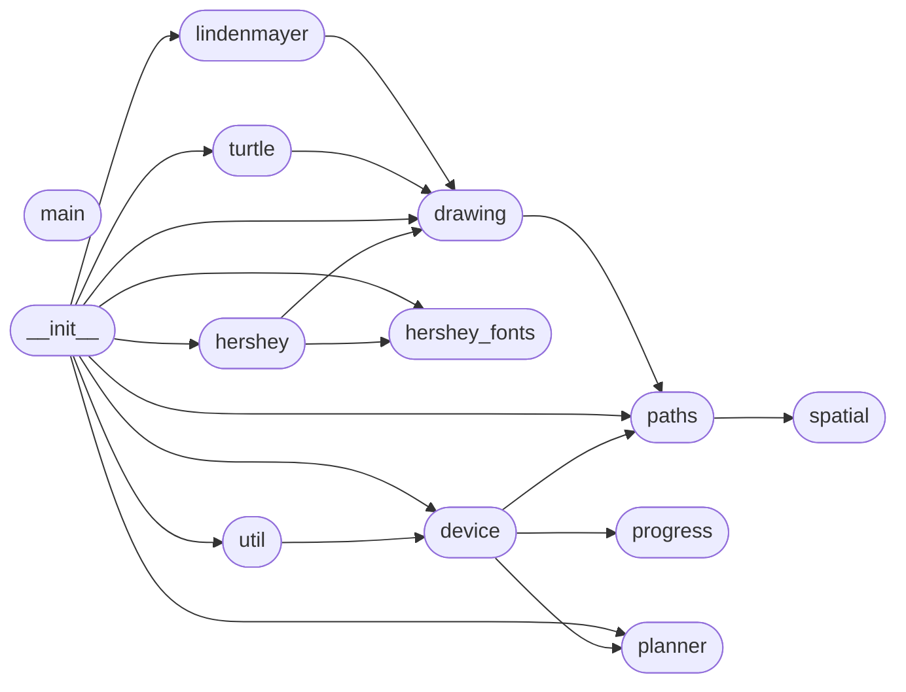

# Code Overview

[_Documentation generated by Documatic_](https://www.documatic.com)

<!---Documatic-section-Codebase Structure Python-start--->
## Codebase Structure Python

The codebase has a flat structure, with 13 code files.

<!---Documatic-block-system_architecture-start--->

<!---Documatic-block-system_architecture-end--->

# #
<!---Documatic-section-Codebase Structure Python-end--->

<!---Documatic-section-Key Objects-start--->
## Key Objects

There are exposed imports at level-0
from the source directory (axi)

<!---Documatic-block-ax-start--->

	
<code>ax</code> (Click to Expand!)

* `axi.device.Device`
* `axi.drawing.A3_BOUNDS`
* `axi.drawing.A3_SIZE`
* `axi.drawing.Drawing`
* `axi.drawing.V3_BOUNDS`
* `axi.drawing.V3_SIZE`
* `axi.hershey.Font`
* `axi.hershey.text`
* `axi.hershey_fonts.ASTROLOGY`
* `axi.hershey_fonts.CURSIVE`
* `axi.hershey_fonts.CYRILC_1`
* `axi.hershey_fonts.CYRILLIC`
* `axi.hershey_fonts.FUTURAL`
* `axi.hershey_fonts.FUTURAM`
* `axi.hershey_fonts.GOTHGBT`
* `axi.hershey_fonts.GOTHGRT`
* `axi.hershey_fonts.GOTHICENG`
* `axi.hershey_fonts.GOTHICGER`
* `axi.hershey_fonts.GOTHICITA`
* `axi.hershey_fonts.GOTHITT`
* `axi.hershey_fonts.GREEK`
* `axi.hershey_fonts.GREEKC`
* `axi.hershey_fonts.GREEKS`
* `axi.hershey_fonts.JAPANESE`
* `axi.hershey_fonts.MARKERS`
* `axi.hershey_fonts.MATHLOW`
* `axi.hershey_fonts.MATHUPP`
* `axi.hershey_fonts.METEOROLOGY`
* `axi.hershey_fonts.MUSIC`
* `axi.hershey_fonts.ROWMAND`
* `axi.hershey_fonts.ROWMANS`
* `axi.hershey_fonts.ROWMANT`
* `axi.hershey_fonts.SCRIPTC`
* `axi.hershey_fonts.SCRIPTS`
* `axi.hershey_fonts.SYMBOLIC`
* `axi.hershey_fonts.TIMESG`
* `axi.hershey_fonts.TIMESI`
* `axi.hershey_fonts.TIMESIB`
* `axi.hershey_fonts.TIMESR`
* `axi.hershey_fonts.TIMESRB`
* `axi.lindenmayer.LSystem`
* `axi.paths.convex_hull`
* `axi.paths.crop_path`
* `axi.paths.crop_paths`
* `axi.paths.join_paths`
* `axi.paths.load_paths`
* `axi.paths.path_length`
* `axi.paths.paths_length`
* `axi.paths.paths_to_shapely`
* `axi.paths.quadratic_path`
* `axi.paths.shapely_to_paths`
* `axi.paths.simplify_path`
* `axi.paths.simplify_paths`
* `axi.paths.sort_paths`
* `axi.planner.Planner`
* `axi.turtle.Turtle`
* `axi.util.draw`
* `axi.util.reset`

<!---Documatic-block-ax-end--->

# #
<!---Documatic-section-Key Objects-end--->

<!---Documatic-section-Important Functions-start--->
## Important Functions

<!---Documatic-block-important_funcs-start--->
<!---Documatic-block-most_used_funcs-start--->
### Most Utilised Functions

* [axi.paths.path_length](3-axi_paths.md#axi.paths.path_length) (2 times)
* [axi.paths.convex_hull](3-axi_paths.md#axi.paths.convex_hull) (2 times)
* [axi.paths.crop_paths](3-axi_paths.md#axi.paths.crop_paths) (2 times)
* [axi.paths.join_paths](3-axi_paths.md#axi.paths.join_paths) (2 times)
* [axi.paths.paths_length](3-axi_paths.md#axi.paths.paths_length) (2 times)
* [axi.paths.simplify_paths](3-axi_paths.md#axi.paths.simplify_paths) (2 times)
* [axi.paths.sort_paths](3-axi_paths.md#axi.paths.sort_paths) (2 times)
* [axi.paths.crop_path](3-axi_paths.md#axi.paths.crop_path) (1 times)
* [axi.paths.load_paths](3-axi_paths.md#axi.paths.load_paths) (1 times)
* [axi.paths.paths_to_shapely](3-axi_paths.md#axi.paths.paths_to_shapely) (1 times)
* [axi.paths.quadratic_path](3-axi_paths.md#axi.paths.quadratic_path) (1 times)
* [axi.paths.shapely_to_paths](3-axi_paths.md#axi.paths.shapely_to_paths) (1 times)
* [axi.paths.simplify_path](3-axi_paths.md#axi.paths.simplify_path) (1 times)
* [axi.util.draw](6-axi_util.md#axi.util.draw) (1 times)
* [axi.util.reset](6-axi_util.md#axi.util.reset) (1 times)
* [axi.hershey.text](4-axi_hershey.md#axi.hershey.text) (1 times)
* [axi.paths.expand_quadratics](3-axi_paths.md#axi.paths.expand_quadratics) (1 times)
<!---Documatic-block-most_used_funcs-end--->

<!---Documatic-block-end_user_funcs-start--->
### End User Exposed Functions

* [axi.paths.path_length](3-axi_paths.md#axi.paths.path_length)
* [axi.device.Device](5-axi_device.md#axi.device.Device)
* [axi.paths.shapely_to_paths](3-axi_paths.md#axi.paths.shapely_to_paths)
* axi.hershey_fonts.GREEKS
* [axi.paths.paths_to_shapely](3-axi_paths.md#axi.paths.paths_to_shapely)
* axi.hershey_fonts.GOTHITT
* [axi.turtle.Turtle](8-axi_turtle.md#axi.turtle.Turtle)
* axi.hershey_fonts.FUTURAL
* axi.hershey_fonts.GREEK
* axi.hershey_fonts.SCRIPTC
* axi.hershey_fonts.GOTHGBT
* axi.hershey_fonts.ROWMANT
* [axi.paths.simplify_paths](3-axi_paths.md#axi.paths.simplify_paths)
* [axi.lindenmayer.LSystem](9-axi_lindenmayer.md#axi.lindenmayer.LSystem)
* axi.drawing.V3_BOUNDS
* axi.hershey_fonts.JAPANESE
* [axi.util.reset](6-axi_util.md#axi.util.reset)
* axi.hershey_fonts.CURSIVE
* [axi.paths.crop_path](3-axi_paths.md#axi.paths.crop_path)
* axi.hershey_fonts.GOTHGRT
* [axi.planner.Planner](10-axi_planner.md#axi.planner.Planner)
* axi.hershey_fonts.SYMBOLIC
* axi.hershey_fonts.TIMESIB
* [axi.paths.simplify_path](3-axi_paths.md#axi.paths.simplify_path)
* [axi.hershey.Font](4-axi_hershey.md#axi.hershey.Font)
* axi.hershey_fonts.MUSIC
* [axi.paths.sort_paths](3-axi_paths.md#axi.paths.sort_paths)
* axi.hershey_fonts.GREEKC
* axi.drawing.V3_SIZE
* [axi.drawing.Drawing](7-axi_drawing.md#axi.drawing.Drawing)
* [axi.paths.quadratic_path](3-axi_paths.md#axi.paths.quadratic_path)
* axi.hershey_fonts.MATHLOW
* axi.hershey_fonts.GOTHICGER
* axi.hershey_fonts.MATHUPP
* axi.drawing.A3_BOUNDS
* axi.hershey_fonts.TIMESG
* [axi.paths.join_paths](3-axi_paths.md#axi.paths.join_paths)
* axi.hershey_fonts.TIMESRB
* axi.hershey_fonts.TIMESR
* [axi.paths.convex_hull](3-axi_paths.md#axi.paths.convex_hull)
* axi.hershey_fonts.GOTHICENG
* axi.hershey_fonts.ROWMAND
* [axi.hershey.text](4-axi_hershey.md#axi.hershey.text)
* axi.hershey_fonts.SCRIPTS
* axi.hershey_fonts.CYRILLIC
* [axi.paths.crop_paths](3-axi_paths.md#axi.paths.crop_paths)
* [axi.paths.load_paths](3-axi_paths.md#axi.paths.load_paths)
* axi.hershey_fonts.ASTROLOGY
* axi.hershey_fonts.CYRILC_1
* axi.hershey_fonts.METEOROLOGY
* axi.hershey_fonts.MARKERS
* axi.hershey_fonts.TIMESI
* axi.hershey_fonts.GOTHICITA
* [axi.paths.paths_length](3-axi_paths.md#axi.paths.paths_length)
* axi.hershey_fonts.FUTURAM
* [axi.util.draw](6-axi_util.md#axi.util.draw)
* axi.hershey_fonts.ROWMANS
* axi.drawing.A3_SIZE
<!---Documatic-block-end_user_funcs-end--->
<!---Documatic-block-important_funcs-end--->

# #
<!---Documatic-section-Important Functions-end--->

<!---Documatic-section-File IO-start--->
## File IO

<!---Documatic-block-file_io-start--->
The following files have file read operations

<!---Documatic-block-axi-start--->

	
<code>axi</code> (Click to Expand!)

* axi.drawing
* axi.paths

<!---Documatic-block-axi-end--->

The following files have file write operations

<!---Documatic-block-axi-start--->

	
<code>axi</code> (Click to Expand!)

* axi.drawing

<!---Documatic-block-axi-end--->
<!---Documatic-block-file_io-end--->

# #
<!---Documatic-section-File IO-end--->

<!---Documatic-section-Class Hierarchy-start--->
## Class Hierarchy

<!---Documatic-block-_Point-start--->

	
<code>_Point</code> (Click to Expand!)

* axi.planner.Point

<!---Documatic-block-_Point-end--->

<!---Documatic-block-object-start--->

	
<code>object</code> (Click to Expand!)

* [axi.device.Device](5-axi_device.md#axi.device.Device)
* [axi.drawing.Drawing](7-axi_drawing.md#axi.drawing.Drawing)
* [axi.hershey.Font](4-axi_hershey.md#axi.hershey.Font)
* [axi.lindenmayer.LSystem](9-axi_lindenmayer.md#axi.lindenmayer.LSystem)
* axi.planner.Block
* axi.planner.Segment
* axi.planner.Throttler
* axi.progress.Bar
* [axi.turtle.Turtle](8-axi_turtle.md#axi.turtle.Turtle)

<!---Documatic-block-object-end--->

# #
<!---Documatic-section-Class Hierarchy-end--->

[_Documentation generated by Documatic_](https://www.documatic.com)