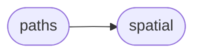

# Axi Paths

[_Documentation generated by Documatic_](https://www.documatic.com)

<!---Documatic-section-Codebase Structure-start--->
## Codebase Structure

<!---Documatic-block-system_architecture-start--->

<!---Documatic-block-system_architecture-end--->

# #
<!---Documatic-section-Codebase Structure-end--->

<!---Documatic-section-axi.paths.path_length-start--->
## [axi.paths.path_length](3-axi_paths.md#axi.paths.path_length)

<!---Documatic-section-path_length-start--->
<!---Documatic-block-axi.paths.path_length-start--->
<details>
	<summary><code>axi.paths.path_length</code> code snippet</summary>

```python
def path_length(points):
    result = 0
    for ((x1, y1), (x2, y2)) in zip(points, points[1:]):
        result += hypot(x2 - x1, y2 - y1)
    return result
```
</details>
<!---Documatic-block-axi.paths.path_length-end--->
<!---Documatic-section-path_length-end--->

# #
<!---Documatic-section-axi.paths.path_length-end--->

<!---Documatic-section-axi.paths.convex_hull-start--->
## [axi.paths.convex_hull](3-axi_paths.md#axi.paths.convex_hull)

<!---Documatic-section-convex_hull-start--->
<!---Documatic-block-axi.paths.convex_hull-start--->
<details>
	<summary><code>axi.paths.convex_hull</code> code snippet</summary>

```python
def convex_hull(points):
    hull = ConvexHull(points)
    vertices = set((i for v in hull.vertices for i in v))
    return [hull.points[i] for i in vertices]
```
</details>
<!---Documatic-block-axi.paths.convex_hull-end--->
<!---Documatic-section-convex_hull-end--->

# #
<!---Documatic-section-axi.paths.convex_hull-end--->

<!---Documatic-section-axi.paths.crop_paths-start--->
## [axi.paths.crop_paths](3-axi_paths.md#axi.paths.crop_paths)

<!---Documatic-section-crop_paths-start--->


### Object Calls

* [axi.paths.crop_path](3-axi_paths.md#axi.paths.crop_path)

<!---Documatic-block-axi.paths.crop_paths-start--->
<details>
	<summary><code>axi.paths.crop_paths</code> code snippet</summary>

```python
def crop_paths(paths, x1, y1, x2, y2):
    result = []
    for path in paths:
        result.extend(crop_path(path, x1, y1, x2, y2))
    return result
```
</details>
<!---Documatic-block-axi.paths.crop_paths-end--->
<!---Documatic-section-crop_paths-end--->

# #
<!---Documatic-section-axi.paths.crop_paths-end--->

<!---Documatic-section-axi.paths.join_paths-start--->
## [axi.paths.join_paths](3-axi_paths.md#axi.paths.join_paths)

<!---Documatic-section-join_paths-start--->
<!---Documatic-block-axi.paths.join_paths-start--->
<details>
	<summary><code>axi.paths.join_paths</code> code snippet</summary>

```python
def join_paths(paths, tolerance):
    if len(paths) < 2:
        return paths
    result = [list(paths[0])]
    for path in paths[1:]:
        (x1, y1) = result[-1][-1]
        (x2, y2) = path[0]
        d = hypot(x2 - x1, y2 - y1)
        if d <= tolerance:
            result[-1].extend(path)
        else:
            result.append(list(path))
    return result
```
</details>
<!---Documatic-block-axi.paths.join_paths-end--->
<!---Documatic-section-join_paths-end--->

# #
<!---Documatic-section-axi.paths.join_paths-end--->

<!---Documatic-section-axi.paths.paths_length-start--->
## [axi.paths.paths_length](3-axi_paths.md#axi.paths.paths_length)

<!---Documatic-section-paths_length-start--->


### Object Calls

* [axi.paths.path_length](3-axi_paths.md#axi.paths.path_length)

<!---Documatic-block-axi.paths.paths_length-start--->
<details>
	<summary><code>axi.paths.paths_length</code> code snippet</summary>

```python
def paths_length(paths):
    return sum([path_length(path) for path in paths], 0)
```
</details>
<!---Documatic-block-axi.paths.paths_length-end--->
<!---Documatic-section-paths_length-end--->

# #
<!---Documatic-section-axi.paths.paths_length-end--->

<!---Documatic-section-axi.paths.simplify_paths-start--->
## [axi.paths.simplify_paths](3-axi_paths.md#axi.paths.simplify_paths)

<!---Documatic-section-simplify_paths-start--->


### Object Calls

* [axi.paths.simplify_path](3-axi_paths.md#axi.paths.simplify_path)

<!---Documatic-block-axi.paths.simplify_paths-start--->
<details>
	<summary><code>axi.paths.simplify_paths</code> code snippet</summary>

```python
def simplify_paths(paths, tolerance):
    return [simplify_path(x, tolerance) for x in paths]
```
</details>
<!---Documatic-block-axi.paths.simplify_paths-end--->
<!---Documatic-section-simplify_paths-end--->

# #
<!---Documatic-section-axi.paths.simplify_paths-end--->

<!---Documatic-section-axi.paths.sort_paths-start--->
## [axi.paths.sort_paths](3-axi_paths.md#axi.paths.sort_paths)

<!---Documatic-section-sort_paths-start--->


### Object Calls

* [axi.spatial.Index](11-axi_spatial.md#axi.spatial.Index)

<!---Documatic-block-axi.paths.sort_paths-start--->
<details>
	<summary><code>axi.paths.sort_paths</code> code snippet</summary>

```python
def sort_paths(paths, reversable=True):
    first = paths[0]
    paths.remove(first)
    result = [first]
    points = []
    for path in paths:
        (x1, y1) = path[0]
        (x2, y2) = path[-1]
        points.append((x1, y1, path, False))
        if reversable:
            points.append((x2, y2, path, True))
    index = Index(points)
    while index.size > 0:
        (x, y, path, reverse) = index.nearest(result[-1][-1])
        (x1, y1) = path[0]
        (x2, y2) = path[-1]
        index.remove((x1, y1, path, False))
        if reversable:
            index.remove((x2, y2, path, True))
        if reverse:
            result.append(list(reversed(path)))
        else:
            result.append(path)
    return result
```
</details>
<!---Documatic-block-axi.paths.sort_paths-end--->
<!---Documatic-section-sort_paths-end--->

# #
<!---Documatic-section-axi.paths.sort_paths-end--->

<!---Documatic-section-axi.paths.crop_path-start--->
## [axi.paths.crop_path](3-axi_paths.md#axi.paths.crop_path)

<!---Documatic-section-crop_path-start--->


### Object Calls

* [axi.paths.crop_interpolate](3-axi_paths.md#axi.paths.crop_interpolate)

<!---Documatic-block-axi.paths.crop_path-start--->
<details>
	<summary><code>axi.paths.crop_path</code> code snippet</summary>

```python
def crop_path(path, x1, y1, x2, y2):
    e = 1e-09
    result = []
    buf = []
    previous_point = None
    previous_inside = False
    for (x, y) in path:
        inside = x >= x1 - e and y >= y1 - e and (x <= x2 + e) and (y <= y2 + e)
        if inside:
            if not previous_inside and previous_point:
                (px, py) = previous_point
                (ix, iy) = crop_interpolate(x1, y1, x2, y2, x, y, px, py)
                buf.append((ix, iy))
            buf.append((x, y))
        elif previous_inside and previous_point:
            (px, py) = previous_point
            (ix, iy) = crop_interpolate(x1, y1, x2, y2, x, y, px, py)
            buf.append((ix, iy))
            result.append(buf)
            buf = []
        previous_point = (x, y)
        previous_inside = inside
    if buf:
        result.append(buf)
    return result
```
</details>
<!---Documatic-block-axi.paths.crop_path-end--->
<!---Documatic-section-crop_path-end--->

# #
<!---Documatic-section-axi.paths.crop_path-end--->

<!---Documatic-section-axi.paths.load_paths-start--->
## [axi.paths.load_paths](3-axi_paths.md#axi.paths.load_paths)

<!---Documatic-section-load_paths-start--->
<!---Documatic-block-axi.paths.load_paths-start--->
<details>
	<summary><code>axi.paths.load_paths</code> code snippet</summary>

```python
def load_paths(filename):
    paths = []
    with open(filename) as fp:
        for line in fp:
            points = filter(None, line.strip().split(';'))
            if not points:
                continue
            path = [tuple(map(float, x.split(','))) for x in points]
            paths.append(path)
    return paths
```
</details>
<!---Documatic-block-axi.paths.load_paths-end--->
<!---Documatic-section-load_paths-end--->

# #
<!---Documatic-section-axi.paths.load_paths-end--->

<!---Documatic-section-axi.paths.paths_to_shapely-start--->
## [axi.paths.paths_to_shapely](3-axi_paths.md#axi.paths.paths_to_shapely)

<!---Documatic-section-paths_to_shapely-start--->
<!---Documatic-block-axi.paths.paths_to_shapely-start--->
<details>
	<summary><code>axi.paths.paths_to_shapely</code> code snippet</summary>

```python
def paths_to_shapely(paths):
    return geometry.MultiLineString(paths)
```
</details>
<!---Documatic-block-axi.paths.paths_to_shapely-end--->
<!---Documatic-section-paths_to_shapely-end--->

# #
<!---Documatic-section-axi.paths.paths_to_shapely-end--->

<!---Documatic-section-axi.paths.quadratic_path-start--->
## [axi.paths.quadratic_path](3-axi_paths.md#axi.paths.quadratic_path)

<!---Documatic-section-quadratic_path-start--->
<!---Documatic-block-axi.paths.quadratic_path-start--->
<details>
	<summary><code>axi.paths.quadratic_path</code> code snippet</summary>

```python
def quadratic_path(x0, y0, x1, y1, x2, y2):
    n = int(hypot(x1 - x0, y1 - y0) + hypot(x2 - x1, y2 - y1))
    n = max(n, 4)
    points = []
    m = 1 / float(n - 1)
    for i in range(n):
        t = i * m
        u = 1 - t
        a = u * u
        b = 2 * u * t
        c = t * t
        x = a * x0 + b * x1 + c * x2
        y = a * y0 + b * y1 + c * y2
        points.append((x, y))
    return points
```
</details>
<!---Documatic-block-axi.paths.quadratic_path-end--->
<!---Documatic-section-quadratic_path-end--->

# #
<!---Documatic-section-axi.paths.quadratic_path-end--->

<!---Documatic-section-axi.paths.shapely_to_paths-start--->
## [axi.paths.shapely_to_paths](3-axi_paths.md#axi.paths.shapely_to_paths)

<!---Documatic-section-shapely_to_paths-start--->
<!---Documatic-block-axi.paths.shapely_to_paths-start--->
<details>
	<summary><code>axi.paths.shapely_to_paths</code> code snippet</summary>

```python
def shapely_to_paths(g):
    if isinstance(g, geometry.Point):
        return []
    elif isinstance(g, geometry.LineString):
        return [list(g.coords)]
    elif isinstance(g, (geometry.MultiPoint, geometry.MultiLineString, geometry.MultiPolygon, geometry.collection.GeometryCollection)):
        paths = []
        for x in g:
            paths.extend(shapely_to_paths(x))
        return paths
    elif isinstance(g, geometry.Polygon):
        paths = []
        paths.append(list(g.exterior.coords))
        for interior in g.interiors:
            paths.extend(shapely_to_paths(interior))
        return paths
    else:
        raise Exception('unhandled shapely geometry: %s' % type(g))
```
</details>
<!---Documatic-block-axi.paths.shapely_to_paths-end--->
<!---Documatic-section-shapely_to_paths-end--->

# #
<!---Documatic-section-axi.paths.shapely_to_paths-end--->

<!---Documatic-section-axi.paths.simplify_path-start--->
## [axi.paths.simplify_path](3-axi_paths.md#axi.paths.simplify_path)

<!---Documatic-section-simplify_path-start--->
<!---Documatic-block-axi.paths.simplify_path-start--->
<details>
	<summary><code>axi.paths.simplify_path</code> code snippet</summary>

```python
def simplify_path(points, tolerance):
    if len(points) < 2:
        return points
    line = geometry.LineString(points)
    line = line.simplify(tolerance, preserve_topology=False)
    return list(line.coords)
```
</details>
<!---Documatic-block-axi.paths.simplify_path-end--->
<!---Documatic-section-simplify_path-end--->

# #
<!---Documatic-section-axi.paths.simplify_path-end--->

<!---Documatic-section-axi.paths.expand_quadratics-start--->
## [axi.paths.expand_quadratics](3-axi_paths.md#axi.paths.expand_quadratics)

<!---Documatic-section-expand_quadratics-start--->


### Object Calls

* [axi.paths.quadratic_path](3-axi_paths.md#axi.paths.quadratic_path)

<!---Documatic-block-axi.paths.expand_quadratics-start--->
<details>
	<summary><code>axi.paths.expand_quadratics</code> code snippet</summary>

```python
def expand_quadratics(path):
    result = []
    previous = (0, 0)
    for point in path:
        if len(point) == 2:
            result.append(point)
            previous = point
        elif len(point) == 4:
            (x0, y0) = previous
            (x1, y1, x2, y2) = point
            result.extend(quadratic_path(x0, y0, x1, y1, x2, y2))
            previous = (x2, y2)
        else:
            raise Exception('invalid point: %r' % point)
    return result
```
</details>
<!---Documatic-block-axi.paths.expand_quadratics-end--->
<!---Documatic-section-expand_quadratics-end--->

# #
<!---Documatic-section-axi.paths.expand_quadratics-end--->

<!---Documatic-section-axi.paths.crop_interpolate-start--->
## [axi.paths.crop_interpolate](3-axi_paths.md#axi.paths.crop_interpolate)

<!---Documatic-section-crop_interpolate-start--->
<!---Documatic-block-axi.paths.crop_interpolate-start--->
<details>
	<summary><code>axi.paths.crop_interpolate</code> code snippet</summary>

```python
def crop_interpolate(x1, y1, x2, y2, ax, ay, bx, by):
    dx = bx - ax
    dy = by - ay
    t1 = (x1 - ax) / dx if dx else -1
    t2 = (y1 - ay) / dy if dy else -1
    t3 = (x2 - ax) / dx if dx else -1
    t4 = (y2 - ay) / dy if dy else -1
    ts = [t1, t2, t3, t4]
    ts = [t for t in ts if t >= 0 and t <= 1]
    t = min(ts)
    x = ax + (bx - ax) * t
    y = ay + (by - ay) * t
    return (x, y)
```
</details>
<!---Documatic-block-axi.paths.crop_interpolate-end--->
<!---Documatic-section-crop_interpolate-end--->

# #
<!---Documatic-section-axi.paths.crop_interpolate-end--->

[_Documentation generated by Documatic_](https://www.documatic.com)