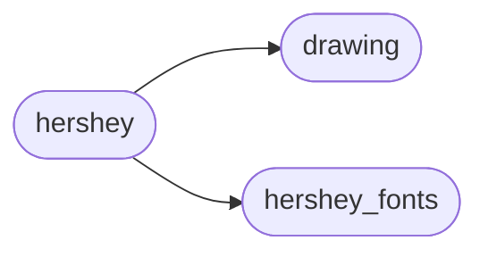
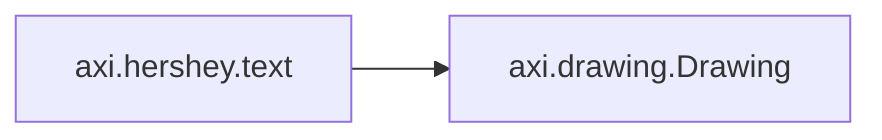

# Axi Hershey

[_Documentation generated by Documatic_](https://www.documatic.com)

<!---Documatic-section-Codebase Structure-start--->
## Codebase Structure

<!---Documatic-block-system_architecture-start--->

<!---Documatic-block-system_architecture-end--->

# #
<!---Documatic-section-Codebase Structure-end--->

<!---Documatic-section-axi.hershey.text-start--->
## [axi.hershey.text](4-axi_hershey.md#axi.hershey.text)

<!---Documatic-section-text-start--->


### Object Calls

* [axi.drawing.Drawing](7-axi_drawing.md#axi.drawing.Drawing)

<!---Documatic-block-axi.hershey.text-start--->
<details>
	<summary><code>axi.hershey.text</code> code snippet</summary>

```python
def text(string, font=FUTURAL, spacing=0, extra=0):
    result = []
    x = 0
    for ch in string:
        index = ord(ch) - 32
        if index < 0 or index >= 96:
            x += spacing
            continue
        (lt, rt, coords) = font[index]
        for path in coords:
            path = [(x + i - lt, j) for (i, j) in path]
            if path:
                result.append(path)
        x += rt - lt + spacing
        if index == 0:
            x += extra
    return result
```
</details>
<!---Documatic-block-axi.hershey.text-end--->
<!---Documatic-section-text-end--->

# #
<!---Documatic-section-axi.hershey.text-end--->

<!---Documatic-section-axi.hershey.Font-start--->
## [axi.hershey.Font](4-axi_hershey.md#axi.hershey.Font)

<!---Documatic-section-Font-start--->
<!---Documatic-block-axi.hershey.Font-start--->
<details>
	<summary><code>axi.hershey.Font</code> code snippet</summary>

```python
class Font(object):

    def __init__(self, font, point_size):
        self.font = font
        self.max_height = Drawing(text(string.printable, font)).height
        self.scale = point_size / 72 / self.max_height

    def text(self, string):
        d = Drawing(text(string, self.font))
        d = d.scale(self.scale)
        return d

    def justify_text(self, text, width):
        d = self.text(text)
        w = d.width
        spaces = text.count(' ')
        if spaces == 0 or w >= width:
            return d
        e = (width - w) / spaces / self.scale
        d = Drawing(text(text, self.font, extra=e))
        d = d.scale(self.scale)
        return d

    def measure(self, text):
        return self.text(text).size

    def wrap(self, text, width, line_spacing=1, align=0, justify=False):
        lines = _word_wrap(text, width, self.measure)
        ds = [self.text(line) for line in lines]
        max_width = max((d.width for d in ds))
        if justify:
            jds = [self.justify_text(line, max_width) for line in lines]
            ds = jds[:-1] + [ds[-1]]
        spacing = line_spacing * self.max_height * self.scale
        result = Drawing()
        y = 0
        for d in ds:
            if align == 0:
                x = 0
            elif align == 1:
                x = max_width - d.width
            else:
                x = max_width / 2 - d.width / 2
            result.add(d.translate(x, y))
            y += spacing
        return result
```
</details>
<!---Documatic-block-axi.hershey.Font-end--->
<!---Documatic-section-Font-end--->

# #
<!---Documatic-section-axi.hershey.Font-end--->

[_Documentation generated by Documatic_](https://www.documatic.com)