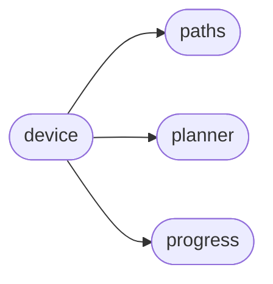

# Axi Device

[_Documentation generated by Documatic_](https://www.documatic.com)

<!---Documatic-section-Codebase Structure-start--->
## Codebase Structure

<!---Documatic-block-system_architecture-start--->

<!---Documatic-block-system_architecture-end--->

# #
<!---Documatic-section-Codebase Structure-end--->

<!---Documatic-section-axi.device.Device-start--->
## [axi.device.Device](5-axi_device.md#axi.device.Device)

<!---Documatic-section-Device-start--->
<!---Documatic-block-axi.device.Device-start--->
<details>
	<summary><code>axi.device.Device</code> code snippet</summary>

```python
class Device(object):

    def __init__(self, **kwargs):
        self.steps_per_unit = STEPS_PER_INCH
        self.pen_up_position = PEN_UP_POSITION
        self.pen_up_speed = PEN_UP_SPEED
        self.pen_up_delay = PEN_UP_DELAY
        self.pen_down_position = PEN_DOWN_POSITION
        self.pen_down_speed = PEN_DOWN_SPEED
        self.pen_down_delay = PEN_DOWN_DELAY
        self.acceleration = ACCELERATION
        self.max_velocity = MAX_VELOCITY
        self.corner_factor = CORNER_FACTOR
        self.jog_acceleration = JOG_ACCELERATION
        self.jog_max_velocity = JOG_MAX_VELOCITY
        for (k, v) in kwargs.items():
            setattr(self, k, v)
        self.error = (0, 0)
        port = find_port()
        if port is None:
            raise Exception('cannot find axidraw device')
        self.serial = Serial(port, timeout=1)
        self.configure()

    def configure(self):
        servo_min = 7500
        servo_max = 28000
        pen_up_position = self.pen_up_position / 100
        pen_up_position = int(servo_min + (servo_max - servo_min) * pen_up_position)
        pen_down_position = self.pen_down_position / 100
        pen_down_position = int(servo_min + (servo_max - servo_min) * pen_down_position)
        self.command('SC', 4, pen_up_position)
        self.command('SC', 5, pen_down_position)
        self.command('SC', 11, int(self.pen_up_speed * 5))
        self.command('SC', 12, int(self.pen_down_speed * 5))

    def close(self):
        self.serial.close()

    def make_planner(self, jog=False):
        a = self.acceleration
        vmax = self.max_velocity
        cf = self.corner_factor
        if jog:
            a = self.jog_acceleration
            vmax = self.jog_max_velocity
        return Planner(a, vmax, cf)

    def readline(self):
        return self.serial.readline().decode('utf-8').strip()

    def command(self, *args):
        line = ','.join(map(str, args))
        self.serial.write((line + '\r').encode('utf-8'))
        return self.readline()

    def move(self, dx, dy):
        self.run_path([(0, 0), (dx, dy)])

    def goto(self, x, y, jog=True):
        (px, py) = self.read_position()
        self.run_path([(px, py), (x, y)], jog)

    def home(self):
        self.goto(0, 0, True)

    def version(self):
        return self.command('V')

    def enable_motors(self):
        m = MICROSTEPPING_MODE
        return self.command('EM', m, m)

    def disable_motors(self):
        return self.command('EM', 0, 0)

    def motor_status(self):
        return self.command('QM')

    def zero_position(self):
        return self.command('CS')

    def read_position(self):
        response = self.command('QS')
        self.readline()
        (a, b) = map(int, response.split(','))
        a /= self.steps_per_unit
        b /= self.steps_per_unit
        y = (a - b) / 2
        x = y + b
        return (x, y)

    def stepper_move(self, duration, a, b):
        return self.command('XM', duration, a, b)

    def wait(self):
        while '1' in self.motor_status():
            time.sleep(0.01)

    def run_plan(self, plan):
        step_ms = TIMESLICE_MS
        step_s = step_ms / 1000
        t = 0
        while t < plan.t:
            i1 = plan.instant(t)
            i2 = plan.instant(t + step_s)
            d = i2.p.sub(i1.p)
            (ex, ey) = self.error
            (ex, sx) = modf(d.x * self.steps_per_unit + ex)
            (ey, sy) = modf(d.y * self.steps_per_unit + ey)
            self.error = (ex, ey)
            self.stepper_move(step_ms, int(sx), int(sy))
            t += step_s

    def run_path(self, path, jog=False):
        planner = self.make_planner(jog)
        plan = planner.plan(path)
        self.run_plan(plan)

    def run_drawing(self, drawing, progress=True):
        print('number of paths : %d' % len(drawing.paths))
        print('pen down length : %g' % drawing.down_length)
        print('pen up length   : %g' % drawing.up_length)
        print('total length    : %g' % drawing.length)
        print('drawing bounds  : %s' % str(drawing.bounds))
        self.pen_up()
        position = (0, 0)
        bar = Bar(drawing.length, enabled=progress)
        for path in drawing.paths:
            jog = [position, path[0]]
            self.run_path(jog, jog=True)
            bar.increment(path_length(jog))
            self.pen_down()
            self.run_path(path)
            self.pen_up()
            position = path[-1]
            bar.increment(path_length(path))
        bar.done()
        self.run_path([position, (0, 0)], jog=True)

    def plan_drawing(self, drawing):
        result = []
        planner = self.make_planner()
        for path in drawing.all_paths:
            result.append(planner.plan(path))
        return result

    def pen_up(self):
        delta = abs(self.pen_up_position - self.pen_down_position)
        duration = int(1000 * delta / self.pen_up_speed)
        delay = max(0, duration + self.pen_up_delay)
        return self.command('SP', 1, delay)

    def pen_down(self):
        delta = abs(self.pen_up_position - self.pen_down_position)
        duration = int(1000 * delta / self.pen_down_speed)
        delay = max(0, duration + self.pen_down_delay)
        return self.command('SP', 0, delay)
```
</details>
<!---Documatic-block-axi.device.Device-end--->
<!---Documatic-section-Device-end--->

# #
<!---Documatic-section-axi.device.Device-end--->

[_Documentation generated by Documatic_](https://www.documatic.com)