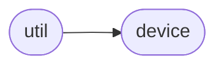

# Axi Util

[_Documentation generated by Documatic_](https://www.documatic.com)

<!---Documatic-section-Codebase Structure-start--->
## Codebase Structure

<!---Documatic-block-system_architecture-start--->

<!---Documatic-block-system_architecture-end--->

# #
<!---Documatic-section-Codebase Structure-end--->

<!---Documatic-section-axi.util.draw-start--->
## [axi.util.draw](6-axi_util.md#axi.util.draw)

<!---Documatic-section-draw-start--->


### Object Calls

* [axi.device.Device](5-axi_device.md#axi.device.Device)

<!---Documatic-block-axi.util.draw-start--->
<details>
	<summary><code>axi.util.draw</code> code snippet</summary>

```python
def draw(drawing, progress=True):
    d = Device()
    d.enable_motors()
    d.run_drawing(drawing, progress)
    d.disable_motors()
```
</details>
<!---Documatic-block-axi.util.draw-end--->
<!---Documatic-section-draw-end--->

# #
<!---Documatic-section-axi.util.draw-end--->

<!---Documatic-section-axi.util.reset-start--->
## [axi.util.reset](6-axi_util.md#axi.util.reset)

<!---Documatic-section-reset-start--->


### Object Calls

* [axi.device.Device](5-axi_device.md#axi.device.Device)

<!---Documatic-block-axi.util.reset-start--->
<details>
	<summary><code>axi.util.reset</code> code snippet</summary>

```python
def reset():
    d = Device()
    d.disable_motors()
    d.pen_up()
```
</details>
<!---Documatic-block-axi.util.reset-end--->
<!---Documatic-section-reset-end--->

# #
<!---Documatic-section-axi.util.reset-end--->

[_Documentation generated by Documatic_](https://www.documatic.com)