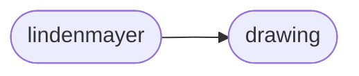

# Axi Lindenmayer

[_Documentation generated by Documatic_](https://www.documatic.com)

<!---Documatic-section-Codebase Structure-start--->
## Codebase Structure

<!---Documatic-block-system_architecture-start--->

<!---Documatic-block-system_architecture-end--->

# #
<!---Documatic-section-Codebase Structure-end--->

<!---Documatic-section-axi.lindenmayer.LSystem-start--->
## [axi.lindenmayer.LSystem](9-axi_lindenmayer.md#axi.lindenmayer.LSystem)

<!---Documatic-section-LSystem-start--->
<!---Documatic-block-axi.lindenmayer.LSystem-start--->
<details>
	<summary><code>axi.lindenmayer.LSystem</code> code snippet</summary>

```python
class LSystem(object):

    def __init__(self, rules):
        self.rules = rules
        self.pattern = re.compile('|'.join(('(%s)' % x for x in rules)))

    def step(self, value):

        def func(match):
            rule = self.rules[match.group(0)]
            if isinstance(rule, str):
                return rule
            return random.choice(rule)
        return self.pattern.sub(func, value)

    def steps(self, value, iterations):
        for i in range(iterations):
            value = self.step(value)
        return value

    def run(self, start, iterations, angle=None):
        program = self.steps(start, iterations)
        angle = angle and radians(angle)
        state = (0.0, 0.0, 0.0)
        stack = []
        paths = []
        point = (0.0, 0.0)
        for instruction in program:
            (x, y, a) = state
            if instruction == '-':
                a -= angle
            elif instruction == '+':
                a += angle
            elif instruction == '[':
                stack.append(state)
            elif instruction == ']':
                (x, y, a) = stack.pop()
                point = (x, y)
            else:
                x += cos(a)
                y += sin(a)
                if paths and point == paths[-1][-1]:
                    paths[-1].append((x, y))
                else:
                    paths.append([point, (x, y)])
                point = (x, y)
            state = (x, y, a)
        return Drawing(paths)
```
</details>
<!---Documatic-block-axi.lindenmayer.LSystem-end--->
<!---Documatic-section-LSystem-end--->

# #
<!---Documatic-section-axi.lindenmayer.LSystem-end--->

[_Documentation generated by Documatic_](https://www.documatic.com)